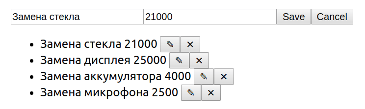
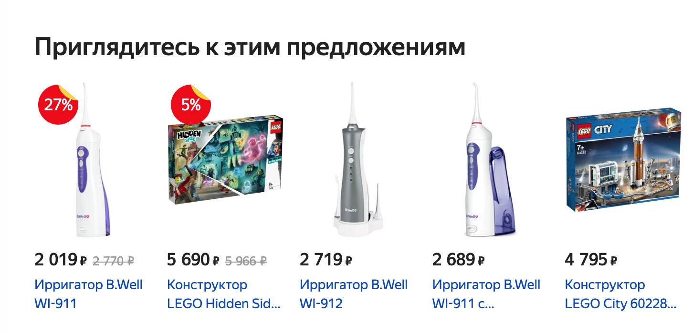

# 10. Домашнее задание к лекции «Redux»
 [[GithubPages](https://igor-chazov.github.io/ra-hw-10_redux_1-2-3)]

---

**Перейти к:**  
***[10.2 Фильтрация](#10.2)  
[10.3 Маркет (Каталог)*](#10.3)***

---
## <a name="10.1">10.1 Редактирование</a>

Данный проект не предполагает взаимодействия по протоколу HTTP и наличия серверной части.

Взяв за основу проект, рассмотренный на лекции, доработайте его следующим образом (либо напишите с нуля):

1. По умолчанию показывается форма добавления (при заполнении и нажатии на кнопку Save) происходит добавление элемента в список:

2. При нажатии на кнопку редактировать форма автоматически заполняется данными элемента

Далее возможны два сценария:

2.1 Если пользователь нажал на кнопку Save, запись в таблице обновляется

2.2 Если пользователь нажал на кнопку Cancel, то поля вычищаются и снова отображается форма добавления

Бонусное задание: подумайте, как должно вести себя приложение, если вы при редактировании записи, нажмёте на удалить (крестик).

---

## <a name="10.2">10.2 Фильтрация</a>
***[(наверх)](#top)***

Данный проект не предполагает взаимодействия по протоколу HTTP и наличия серверной части.

Взяв за основу проект, рассмотренный на лекции (или ***[проект редактирования](#10.1)***) предложите вариант реализации возможности фильтрации: т.е. у вас должно быть строковое поле, при введении данных в которое, будут отображаться только объекты, у которых название содержит введённую строку.

Предложите собственную реализацию данной функциональности.

Обратите внимание:
1. При пустом значении фильтра должны показываться все объекты
1. Неважно, заполнен фильтр или нет - все функции редактирования (добавление/обновление/удаление) должны быть доступны

Напоминаем, что фильтр - это просто текстовое поле.

**Важно**: попробуйте проанализировать существующие системы на предмет того, как это реализовано у них и на базе этого предложить собственное решение.

---

## <a name="10.3">10.3 Маркет (Каталог)*</a>
***[(наверх)](#top)***

Данный проект не предполагает взаимодействия по протоколу HTTP и наличия серверной части.

В данной задаче вы выступите в роли аналитика и проектировщика. На базе существующего сервиса вам самостоятельно необходимо спроектировать и реализовать на базе Redux форму добавления и отображения товаров (важно: нас интересует только добавление и отображаение*).

Примечание*: редактирование и удаление делать не нужно.

Задача: разаработайте на базе Redux форму добавления и отображения товаров как в Яндекс.Маркете.

Обратите внимание: на базе примера с лекции - вы должны сами выступить в роли проектировщика и решить какие поля и в каком виде (строка, число, boolean) вы будете хранить.

Задача вашего приложения - проектирование формы добавления и реализация списка для отображения:

Скриншот сервиса [Яндекс.Маркет](https://market.yandex.ru/)

---

